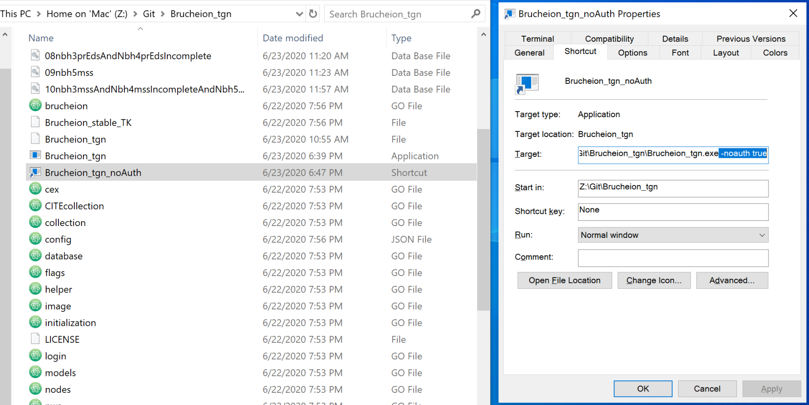
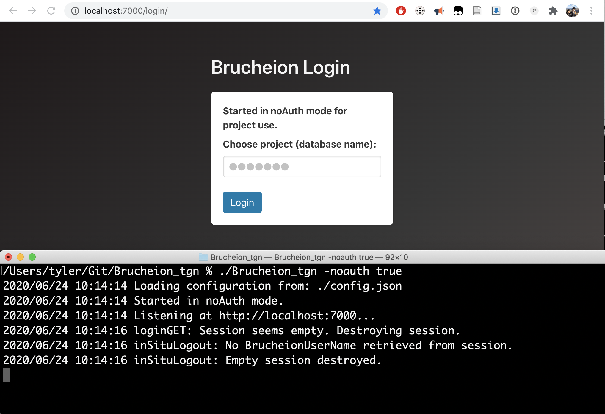
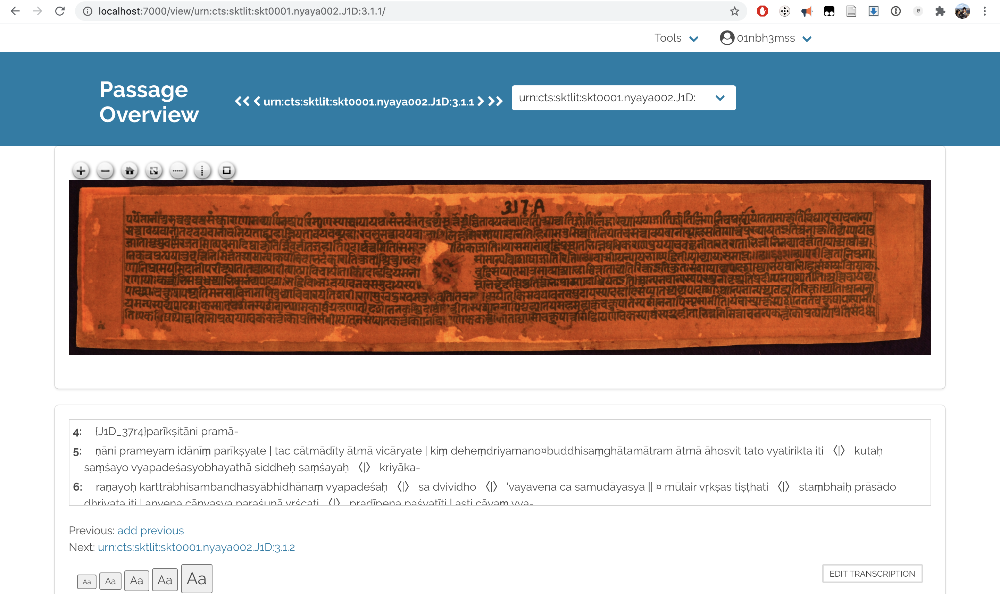

Overview
-------

This project is a fork of [Brucheion](https://github.com/Brucheion/Brucheion), which continues to actively develop toward its goal of being “a Virtual Research Environment (VRE) to create Linked Open Data (LOD) for historical languages and the research of historical objects”. In this fork, only such small changes to the code were made as were necessary to accomodate my own divergent, limited use of an intermediate stage of Brucheion (2019 – early 2020) as only a *supplementary visualization* tool in combination with two other pieces of software: the [Classical Text Editor](https://cte.oeaw.ac.at/) (CTE) and a custom-built, [Python-based pipeline for converting to Brucheion's CEX format](https://github.com/tylergneill/cte2cex) (cte2cex). This was done in the context of research on Sanskrit material, specifically. -tgn

Data Prep Prerequisites
--------

In the future Brucheion VRE, it should become possible to start with nothing but images of one's textual object(s) (e.g., manuscript folia) and then proceed immediately to ingest those images into the VRE, create text transcriptions of them, and link the transcriptions to the images or even parts thereof, all within the program's graphical user interface (GUI).

In the different workflow which this fork accommodates, by contrast, images are prepared and added to Brucheion manually, transcripts are prepared elsewhere (either in CTE or in plain-text), and image-text relations are established automatically by the cte2cex conversion tool on the basis of the carefully prepared transcripts. Prepared Sanskrit data is available at the following locations:

Nyāyabhāṣya "sliced" (DZI) image files: [https://gitlab.com/dfg_nbh/nbh](https://gitlab.com/dfg_nbh/nbh) (private)

Nyāyabhāṣya CEX project files: [https://gitlab.com/dfg_nbh/cex](https://gitlab.com/dfg_nbh/cex)

For more detail on getting this data set up for use, see the "Image Archive Setup" and "CEX Setup" sections below.

Installation
--------

Install this version of Brucheion by simply downloading the repository. Executable (binary) files for macOS and Windows are provided, and these can hopefully be run directly. If they do not work, one can recompile one's own binary for the system one is currently running with 

~~~~
go build -v
~~~~

or for another system with a command like

~~~~
env GOOS=windows GOARCH=amd64 go build -v
~~~~

> Tips for recompiling: 1) First install the latest version of Golang [here](https://golang.org/doc/install). 2) Install any required packages that appear in the build error message, using the `go get` command. 3) Adjust the environment variables as needed if building for other operating systems. 3) Don't forget the `-v` flag.

Startup and Login
------

With this fork, in a major divergence from Brucheion's intended "user"-based, online collaboration framework, online authentication features are bypassed and the "user" functionality is entirely repurposed for the sake of local management of multiple project workspaces.

To start the program with the authentication bypass, pass in the additional parameter `-noauth true`. In order to do this, it's easiest to launch from the command line, e.g., in macOS (and similarly in Linux):

~~~~
./Brucheion_tgn -noauth true
~~~~

> Tip: In Windows, this is equally possible with the command line. Otherwise, in order to start by double clicking on an icon while still also bypassing the authorization, it is necessary to first have a shortcut point to the `.exe` file, and then, under this shortcut's `Properties` menu, to add `-noauth true` to the end of the `Target` field. This will cause the parameter to be passed in every time the shortcut is used.

If start-up was successful, the command line will provide the following status update:

~~~~
Listening at:7000...
~~~~

Now open a browser of your choice and navigate to:

`localhost:7000/login/`

> Tip: Bookmark this URL in your browser.

At this screen, choose a project by typing in the name that will match the corresponding database (`.db`) file located at the top level of the Brucheion folder (e.g., "01nbh3" to pick out `01nbh3.db`). If creating a new project, simply type the new name here.

The next screen confirms the choice. 

Now click `Forward to Mainpage`. 

The following landing page is very rough, with a few hard-coded links allowing access to particular points within particular projects. 

Any valid URL endpoint within the chosen project will suffice for getting into the GUI, but since Brucheion was developed in the context of the DFG project at Leipzig focusing on Nyāyabhāṣya chapters (*adhyāya*s) 3–5, here, two links are provided specifically for each of these three chapters, in particular, one for each the two major visualization modes developed so far: `Passage Overview` and `Multicompare`. For other projects (e.g., my own dissertation research on the Nyāyabhūṣaṇa), one can in turn rely solely on browser bookmarks. Finally, there is also a `Log out` link, with which one can go back and choose a different project. 

> Bug Note: Once logged in, closing the command line process prematurely, i.e. without logging out in the browser, currently results in a browser cookie problem. When this happens, find and delete the relevant cookie (e.g., by searching for "localhost" in `chrome://settings/siteData`, then begin again like normal. To avoid this problem, always log out in the browser before terminating the command line process. This problem has already been fixed in the main, official version of Brucheion and should eventually be fixed here, too.

Loading a database
---------

For the sake of this tutorial, one should first load a database from a CEX file. The provided CEX files are intended to be loaded as the following databases:

|CEXfile												|databasename|
|-------------------------------------------------------|---------------------------------------|
|nbh_3_mss.cex											|01nbh3mss|
|nbh_3_pr_eds.cex										|02nbh3prEds|
|nbh_3_jaisalmer.cex									|03nbh3jaisalmer|
|nbh_3_test_collation.cex								|04nbh3testCollation|
|nbh_4_mss_incomplete.cex								|05nbh4mssIncomplete|
|nbh_4_pr_eds_incomplete.cex							|06nbh4prEdsIncomplete|
|nbh_3_mss_and_4_mss_incomplete.cex						|07nbh3mssAndNbh4mssIncomplete|
|nbh_3_pr_eds_and_nbh_4_pr_eds_incomplete.cex			|08nbh3prEdsAndNbh4prEdsIncomplete|
|nbh_5_mss.cex											|09nbh5mss|
|nbh_3_mss_and_nbh_4_mss_incomplete_and_nbh_5_mss.cex	|10nbh3mssAndNbh4mssIncompleteAndNbh5mss|

To load, for example, the first of these CEX files manually (as opposed to with the help of cte2cex, see which), while logged into project `01nbh3mss`, and with the CEX in their proper folder (`Brucheion/cex`) enter the following URL in a new tab:

`localhost:7000/load/nbh_3_mss`

A "success" message in that tab should confirm the load. Since we are loading manually, we should also do the same with the URL:

`localhost:7000/newCITECollection/urn:cite2:nyaya:J2img.positive:/

> For more on this, see `(Initialize Image Database)` in "Features available only as endpoints" below.

Now navigate back to the landing page.

For the sake of this tutorial, proceed by clicking on `Passage Overview`.

Passage Overview Mode
---------

This is the image-to-text alignment mode.

Here the object image is front-and-center. The image viewer has buttons for zoom, and moving is possible with click-and-drag, or else one can also simply use the trackpad. There are also simple, temporary shape drawing features like lines and boxes.

> Tip: Simply refresh the page to clear such drawn features.

In this fork (which focuses on South Asian material in mostly horizontal or landscape layout), the corresponding text appears below the image (as opposed to on the right in the master branch; eventually it should be possible to toggle between the two, such as is already possible with e.g. `Transcription Desk`, compare note on which below). This text box has fixed dimensions with a scroll bar, to facilitate maximally close comparison of image and text. Text size can be adjusted with the provided buttons.

Above the image, arrow buttons are provided for moving between adjacent passages as defined by CTS URNs (see above for links to background on this citation architecture). To the right of the arrows is a dropdown box with which one can change to other witnesses also extant for the chosen passage. One can also simply modify the URL directly.

Below the text are a number of other features (e.g. metadata) and links to other program modes (e.g., `Transcribe`) not needed for the visualization functionality being described here.

At the very top of the page are two menus. The first, `Tools`, contains links to the other modes, most notably `Multicompare`. The second menu, named after the current project, contains a `Log out` link, which will bring one back to the Login screen where a different project can be chosen.

For now, under `Tools`, choose `Multicompare` to go to the other of the main two modes.

> Tip: In addition to Brucheion's own navigation buttons and menus, the browser's native forward and back buttons and other browsing history features can be used as normal, provided that one remains logged into the relevant project.

Multicompare Mode
--------

This is the one-to-many text alignment mode.

Here, a base text appears on the lefthand side, and a blank space appears on the righthand side where other witnesses will be aligned. As in `Passage Overview` mode, the overall passage focus can be changed with the arrow buttons. The adjacent witness dropdown box, by contrast, has a slightly different function here: It specifically determines the base text on the *lefthand* side. Below the dropdown box appear several white buttons that can in turn be used to select (by simple siglum) a second witness for alignment on the *righthand* side.

Once selected, the second witness appears on the righthand side, complete with interactive alignment. 

Yellow color in the base text on the lefthand side  reflects *total, overall* variation in *all witnesses* relative to the base text. Green color in the aligned text on the righthand side indicates *specific* variation in *only that witness* relative to the base text.

For this alignment, the lemmata selection — here: chunking by entire words or groups thereof — is currently only automatic (based on an implementation of the Needleman-Wunsch algorithm) and cannot be altered.

> But: Compare `Alignment Table` in "More user-facing features coming soon" below.

Hovering with the mouse over text on either side results in tandem highlighting in bold of such corresponding groups on both sides. Clicking on an alignment group on either side results in (persistent bold highlighting at that spot and) a variants summary for that lemma at bottom left. The blue sigla links in this variant summary currently function just as the white buttons above do: to change the selection of the right alignment text.

There is also an option to align and view orthographically normalized transcription text, so as to be able to focus on more significant differences.

For more on this, see `(Normalize Orthography)` below under "Features available only as endpoints".

Note also that the same top menus still apply: Under `Tools`, one can return to `Passage Overview`, maintaining focus on the selected base text, or under the second menu, one can `Log out` to end the session and/or switch to a different project.

> Note: Moving from `Multicompare` to `Passage Overview` while maintaining focus on the *aligned witness on the righthand* side is not yet supported.

> Similar Note: It's also not yet possible to use the arrow keys to move between passages in `Multicompare` while maintaining focus on the same aligned witness on the righthand side; one must either choose it again by clicking, or one can move between passages by modifying the URL directly (without changing the aligned witness parameter after the hashtag).

Updating with cte2cex Conversion Pipeline
--------

In the course of using Brucheion to visualize transcript data, one may make new discoveries, and it may become necessary to make changes to that textual data in the primary files (e.g., CTE, txt). In order to update Brucheion with the new changes, first one should be logged into the desired project. While logged in, go to the command line and run the cte2cex conversion script for the given project (i.e., with the project JSON file) along with the `-u` flag in order to update the database by overwriting it with the re-imported transcript data. 

The reloading of the new cex data into the database will produce a new tab in the browser confirming the operation. If the orthography normalization option in the cte2cex project config file is selected, this will also be redone at this time, again in its own new tab.

See [separate cte2cex GitHub repo](https://github.com/tylergneill/cte2cex) for more.

Image Archive Setup
-------

Images used with this fork are preprocessed by "tiling" or "slicing" them to produce Dynamic Zoom Images (DZI). For this, one can use Image Magick, VoidVolker's [MagickSlicer](https://github.com/VoidVolker/MagickSlicer), and some sort of automation workflow (see, e.g., [my own simple Python script here](https://github.com/tylergneill/loop_magick_slicer)). All sliced images for the DFG Nyāyabhāṣya project are currently available in a [private GitLab repo](https://gitlab.com/dfg_nbh/nbh).

In order for these sliced images to be found and used by Brucheion, they must here be manually placed within the folder `Brucheion/static/image_archive` in a nested folder sub-structure corresponding to the CITE URN protocol. For example, assuming an archive titled "nbh", with multiple witnesses among which is a "J1", with two versions "positive" and "negative", and with individual folios "37r" and "37v", the following CITE URNs

~~~~
urn:cite2:nbh:J1img.positive:J1_37r
urn:cite2:nbh:J1img.negative:J1_37v
~~~~

would correspond to the following structure within `Brucheion/static/image_archive`

> Note: In the Sanskrit projects behind the present description, some pains have been taken to maintain a distinction between (logical) CTS URNs and (object) CITE URNs as regards witness sigla. Namely, manuscript sigla, which contain a letter or letters designating the script (D - Devanāgarī, S - Śāradā, ML - Malayalam, etc.), drop this element in the CITE URN. Thus "J1D" in the logically-oriented CTS URNs corresponds to "J1" in the physically-oriented CITE URNs. Thus, an example RDF triple relating the two types of URN reads:

~~~~ 
urn:cts:sktlit:skt0001.nyaya002.J1D:3.1.1#urn:cite2:dse:verbs.v1:appearsOn:#urn:cite2:nbh:J1img.positive:J1_37r
~~~~

> Note also the similar difference in the workspace protocol ("skt0001.nyaya002") and the image archive name ("nbh"). The point here is a didactic one: to maintain the conceptual distinction between the two types of URNs. Such a distinction, however, is by no means technically necessary.

Once positioned in this way, images are now ready for Brucheion to find and associate with text, whether through the Image Citation Editor (not used here, see below) or through relations imported in the CEX file.

CEX Setup
-----

Transcripts prepared outside of Brucheion can be done so either in CTE (as in the DFG Nyāyabhāṣya project) or in plain-text format (as in my own dissertation research on the Nyāyabhūṣaṇa); the associated cte2cex conversion tool accepts both. More importantly, however, the textual content of these transcripts must be formatted rather strictly, especially including particular milestones for both logical and physical transition points.

Logical milestones (a.k.a. "chapter" or "passage identifiers") anticipate CTS URNs (see [here](https://www.homermultitext.org/hmt-doc/cite/texts/ctsoverview.html) and [here](http://cite-architecture.org/cts/) for background info on the CITE architecture): for example, "3.1.1" for book 1, section 1, verse 1 in the Nyāyabhāṣya.

The format of physical milestones (a.k.a. "object identifiers" or more simply folio/page and line breaks) is assumed by cte2cex to consist of a "siglum" abbreviation of the source plus other material (e.g., "J1D_102r1", for witness J1D, folio 102, side r, line 1). 

For more on these specifications, see cte2cex's [input guidelines](https://github.com/tylergneill/cte2cex/blob/master/input_guidelines.md).

Ultimately, all transcript material for a given project to be visualized in Brucheion must be consolidated into a single CEX (`.cex`) file, which becomes the basis for the Bolt database (`.db`) file. A CEX file, as used here (further detail can be found [here](...)), is comprised of three blocks of data:

* `#!ctscatalog`: defines which witnesses are involved in a given project.

* `#!ctsdata`: the actual textual data, formatted in two columns with hashtag (#) as a  separator

* `#!relations`: here, just text-to-image relationships, expressed as RDF triples (e.g., "(text x) (appears on) (image y)")

If building a new project from scratch for use with such a protocol, it takes considerable effort to transform one's textual data into this format. Firstly, one must certainly already have segmented one's text into reasonably sized portions, each with its own CTS identifier, and these logical divisions must be marked unambiguously in the transcription data itself. Next, all non-plain-text content (font formatting, XML tags, etc.) must be filtered out somehow; for this, the cte2cex pipeline, based on regular expressions, can  lend a hand.

> Note: Line breaks are specially provided for within Brucheion by the tag "-NEWLINE-"  in the Golang code-base itself. Other such tags may eventually be forthcoming.

Finally, one must actually put together the CEX file itself, completely with proper formatting (i.e., proper use of blocks and separators, etc.) For developing a new project, it's easiest to simply copy an existing project and make changes as necessary.

> Note: In keeping with use of Brucheion for visulization only, the CEX format here serves only to consolidate data from elsewhere and to use it to populate an internal Bolt database. As a side note, conversion in the opposite direction, from Bolt database to CEX file, is also theoretically possible, by way of the CEX export feature (`Download CEX`; see "User-facing features not utilized here" below).

The `#!ctsdata` block is most essential. Each line of identifier and content constitutes a node. Nodes are connected to each other via "previous" and "next" relationships within the corresponding Bolt database; these are established upon import based on their ordering relative to each other in the CEX file. Thus, while identifiers may well constitute a logical numerical sequence, they need not do so. It is also possible to create and populate nodes totally within the GUI, at run-time, but currently it is only possible to do so at the beginning or end of a sequence of a given work; in any case, no run-time modification functionality is used in the visualization implementation described here.

The `#!relations` block is used here to prepopulate the database with relations worked out in advance, with the help of the cte2cex conversion tool, based on the transcription files.

Namely, once one's transcript data consistently marks both chapter and object identifiers with consistent formatting, it is then merely a mechanical matter to extract a linear sequence of such identifiers, on the one hand, and textual content, on the other, and then from this sequence, one can further mechanically build a table of paired identifiers, which then simply needs to be formatted as RDF triplets (here: chapter-verb-object) which can then be incorporated directly into the CEX file. It's also possible to use the `Image References Editor` within the GUI to specify individual relations, even to the level of parts of images, but that is not used here.

Finally, a CEX file must be placed in the `Brucheion/cex` folder in order for the `load` call to find it.

Features available only as endpoints
----------

* `(Load CEX)`: for ingesting CEX data; creates or overwrites the internal Bolt database (`.db`), which is stored at top level of Brucheion directory; endpoint shape: `load/{cex}/`

> Note: For any work mentioned in the CEX file being loaded, all associated nodes already existing in the database will be deleted. Then, the individual nodes mentioned in said CEX file will be reinstated in the database with their newly loaded content.

* `(Initialize Image Database)`: for creating a internal to manage available image files; must be done once for each newly created project (main Brucheion: "user") database; endpoint shape: `newCITECollection/{urn}`

> Note: Any URN will work, but then it will be the "Collection" name that appears in, for example, `Image Citation Editor`, see more on which below.

* `(Normalize Orthography)`: for creating a orthographically normalized version of database text to be displayed in `Multicompare` mode; endpoint shape: `normalizeAndSave/all/`

> Usage Tips:

	1. This command (re)-normalizes the entire database at once. There also exists an alternative API endpoint of shape `normalizeTemporarily/{urn}`, which normalizes only a single passage of a single work, without saving, and so it can be used for testing.
	2. The display of normalized text in `Multicompare` can be toggled in the Brucheion config file (`config.json`).
	3. This normalization works by way of regular expressions. A different set of language- or dialect-specific regular expressions can be created on the pattern of the Sanskrit one provided and then chosen in the file `config.json`.
	4. Changes to the config file only take effect upon starting Brucheion. To refresh with new options, log out of Brucheion, terminate the process, then start the process and log back in again, navigating back to the desired page.

User-facing features not utilized here
----------

* `Edit Metadata`: for editing catalog data (corresponding to `#!ctscatalog` block of CEX file) in Brucheion's internal Bolt database

* `Transcription Desk`: for creating and editing transcription data (corresponding to `#!ctsdata` block of CEX file) for storage in Brucheion's internal Bolt database; currently features a toggle between horizontal and vertical orientations

* `Image Citation/(Reference) Editor`: for creating and editing text-to-image relation data (corresponding to `#!relations` block of CEX file) in Brucheion's internal Bolt database; usage involves building and saving a `#`-separated list of CITE URN object references in the `ImageRef` box on the right with the help of the controls on the left (viewer plug-in — which also facilitates specifying subparts of images — as well as dropdown menus, among which "Select Image" currently seem unable to give access any individual items)

* `Download CEX`: for exporting internal Bolt database as a single CEX file; output not yet round-trip compatible with `load` feature

More user-facing features coming soon
----------

* `Alignment Table`: for inspecting and modifying automatically generated text alignments; this may also be where import of CTE alignment data into Brucheion will be managed; endpoint shape: `tablealignment/{urn}`

* `Folio Ingestion`: for loading images into Brucheion by GUI; endpoint shape: `ingest/`

* `Account Settings` and `Display Settings`: ostensibly for setting user permissions and display options; endpoint has not been populated yet, on offer in right burger menu

Deprecated features
----------

* `Transcription Comparison`: the one-to-one precursor of one-to-many Multicompare; still works but is no longer used; endpoint shape: `compare/{urn}+{urn2}/`

* `Transcription Consolidation`: for choosing between competing transcriptions; no longer seems to work; endpoint shape: `/consolidate/{urn}+{urn2}/`

* `Morpho-Syntactic Treebank`: for creating and viewing sentence treebanks; never implemented in working condition; endpoint shape: `tree/`; accessible through left burger menu